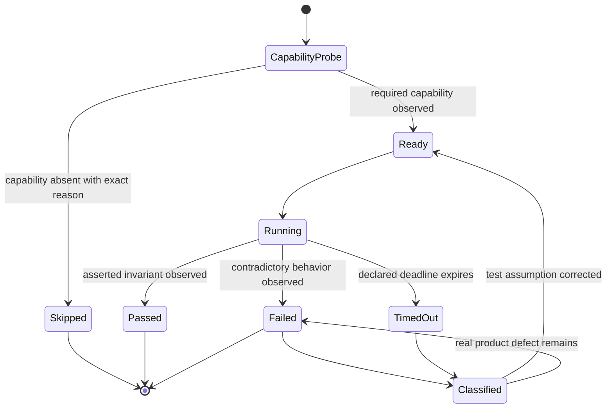

# Host baseline test failures plan

## Problem statement

A baseline test run must distinguish a product regression from an unsupported host capability, an outdated fixture assumption, a nondeterministic concurrency observation, and a stalled external process.
Today, failures from those categories can look identical, and one external-process stall can consume hours before producing a result.
The result is neither a reliable regression signal nor a useful explanation of why a host cannot execute a test.

## Optimal solution

Every test follows one explicit state machine.

The capability probe observes behavior rather than inferring support from a version string.
An unsupported capability exits successfully only after printing one concrete `skip:` reason that names the missing requirement and the observed environment.
A supported capability always reaches the real behavior assertion.

Concurrent behavior is judged by durable invariants.
The final topology must contain the exact expected members, each owning block must remain contiguous, unrelated members must retain their relative order, and focus must remain stable.
The state machine does not assign meaning to which of two simultaneous callers happens to win first.

Every wait has a named deadline.
Arrival of the expected event transitions to the next state, early process exit fails with that reason, and deadline expiry fails with a diagnostic that names the awaited event and bound.
External job queueing and execution use test-scale deadlines so repeated stalls cannot accumulate into an hours-long run.

The aggregate baseline is green only when every test either passes or reports a precise environment skip.
No test is deleted, and no unsupported environment is represented as an unexplained success.
